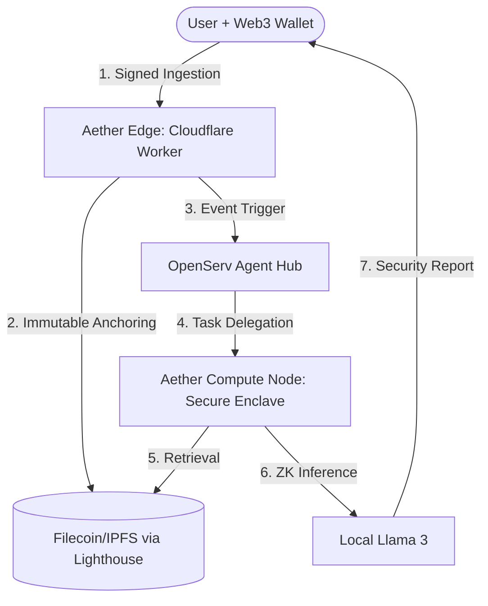

# Aether Protocol: Self-Sovereign Zero-Knowledge Intelligence

Aether Protocol is a decentralized framework for autonomous AI agents to process sensitive data with cryptographically verifiable privacy. By decoupling data anchoring (Filecoin) from ephemeral compute (Aether Compute Nodes), the protocol ensures that confidential information remains private while remaining accessible to state-of-the-art intelligence models.

---

## 🏗 System Architecture (HLD)

The Aether Protocol architecture is designed for "Shared-Nothing" decentralization, ensuring no single point of data leakage.



---

## 🔒 Technical Design (LLD)

### Data Lifecycle & Orchestration Flow

The following sequence diagram illustrates the low-level interaction between the protocol's core layers:

```mermaid
sequenceDiagram
    participant U as User / Wallet
    participant W as Cloudflare Edge (Worker)
    participant S as Filecoin/Lighthouse
    participant O as OpenServ Hub
    participant C as Aether Compute Node (TEE)

    U->>U: Generate Consent Signature
    U->>W: POST /upload (File + Signature)
    W->>W: Verify Self-Sovereign Consent
    W->>S: multipart/form-data upload
    S-->>W: 200 OK (CID)
    W->>O: Webhook Trigger (CID + Metadata)
    O->>C: POST /api/compute (Orchestration)
    
    rect rgb(20, 20, 40)
        Note over C: Initialization (Secure Enclave)
        C->>S: Fetch Ciphertext (Gateway Fallback)
        S-->>C: Data Stream
        C->>C: Local Llama 3 Inference
        C->>U: Stream Result (Security & Integrity Report)
        C->>C: Ephemeral Memory Wipe
    end
```



---

## 🛠 Core Components

### 1. Autonomous Edge Ingestion
The entry point of the protocol is an **Aether-Edge Worker** (Cloudflare Global Edge). It handles high-throughput bit-streams and performs permissionless anchoring to the **Filecoin Calibration Testnet** using the Lighthouse API.
- **Protocol**: `multipart/form-data`
- **Integrity**: Immediate CID generation for downstream tracing.

### 2. Self-Sovereign Consent Layer
All ingestion requests require a **cryptographic signature** (EIP-191/712). This ensures that the Aether Protocol only processes data explicitly authorized by the data owner's private key.

### 3. Event-Driven Orchestration
The **OpenServ Agent Hub** acts as the protocol's routing layer. It receives webhooks containing the CID and metadata, then delegates compute tasks to optimized sub-agents withoutever ever interacting with the raw data payload.

### 4. Zero-Knowledge Private Compute
Actual inference is executed on **Aether Compute Nodes** (Simulated Secure Enclaves). 
- **Retrieval**: Multi-gateway IPFS fetch with exponential backoff.
- **Inference**: Local **Llama 3** (via Ollama) performs zero-knowledge reasoning.
- **Cleanup**: Ephemeral environment destruction and memory wiping post-inference.

---

## 💻 Tech Stack

- **Frontend**: Next.js 15+ (React 19), Tailwind CSS v4
- **Web3**: ConnectKit, WAGMI (Wallet Auth)
- **Edge**: Cloudflare Workers (Lighthouse SDK Integration)
- **Decentralized Storage**: Filecoin / IPFS
- **Orchestration**: OpenServ AI Agent Hub
- **Inference Engine**: Llama 3 (Local NoCap-AI Node)

---

## 🚀 Getting Started

### 1. Environment Configuration
Create a `.env.local` file in the root directory:
```env
LIGHTHOUSE_API_KEY=your_key
NEXT_PUBLIC_CLOUDFLARE_WORKER_URL=your_worker_url
NEXT_PUBLIC_WALLETCONNECT_PROJECT_ID=your_project_id
```

### 2. Development Setup
```bash
# Install dependencies
npm install

# Run the Aether Protocol local node
npm run dev
```

The application will be available at `http://localhost:3000`.
